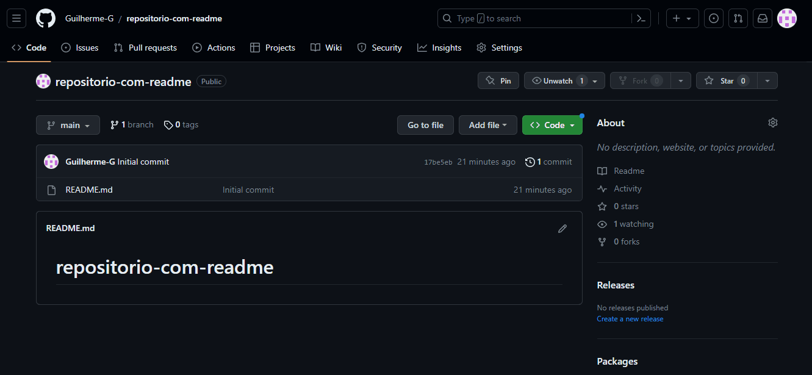

# Projeto com README

Um projeto de teste com um arquivo README🚀
[](https://google.com)

## Tecnologias utilizadas

- HTML
- CSS
- JS
## Como utilizar
1 - Clone pro projeto
```
git clone <url>
```
2 - acesse a pasta do projeto
```
cd repositorio-com-readme
```